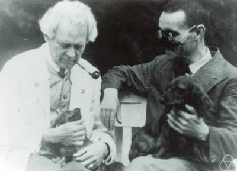
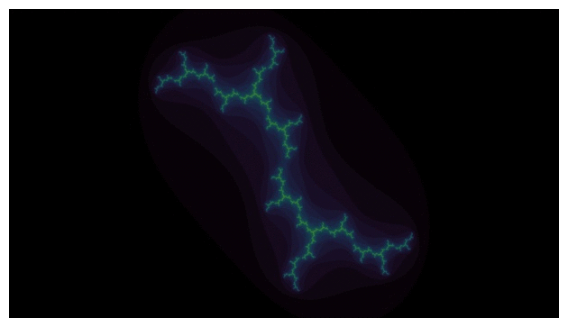
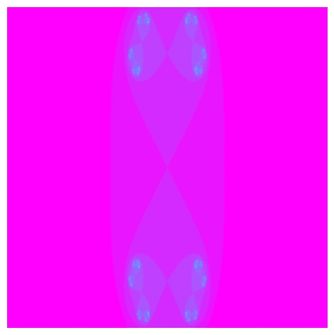

# Julia's Clock

The clock based on the Julia Sets. The idea of this quick coding project was to parametically draw out a unit circle in the complex plane with a discrete set of values, find the corresponding Julia Set for every number on the unit circle, and integrate it into a clock that allows the user to tell time. In short the clock functions as follows: each Julia Set found on the unit circle corresponds to the minute hand on the clock, each color mapping denotes a diffent hour in the day, and thus by using python to automatically update the desktop wallpaper we have a method that lets us tell time via the Julia Sets.
## Official Documentation:
```
https://nick-g-1497.github.io/JuliasClock/html/index.html
```
## Julia Sets
This clock wouldn't have been possible without the work of Gaston Julia depicted bellow (https://en.wikipedia.org/wiki/Gaston_Julia). For an explaination of what the Julia Sets are please refer to (https://www.youtube.com/watch?v=dctJ7ISkU-4)


## Clock - parametric path of the unit circle


## Timer - parametric path of an inward spiral

